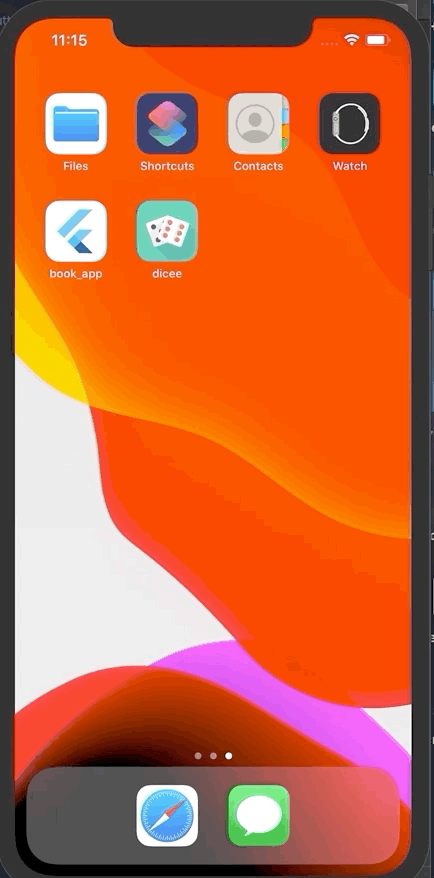

# Dicee


A simple dice roller app built with Flutter. Tap either die to randomly roll both dice.

## Features

- Two dice displayed side by side
- Tap to roll both dice randomly (1-6)
- Dice face images update on each roll

## Tech Stack

- **Framework:** Flutter
- **Language:** Dart

## Project Structure

```
├── lib/
│   └── main.dart                 # Dice UI with random generation
└── images/
    ├── dice1.png - dice6.png     # Dice face images
```

## Getting Started

**Prerequisites:** [Flutter SDK](https://flutter.dev/docs/get-started/install)

```sh
git clone https://github.com/khan-rehan/Dice.git
cd Dice
flutter run
```

## Demo


